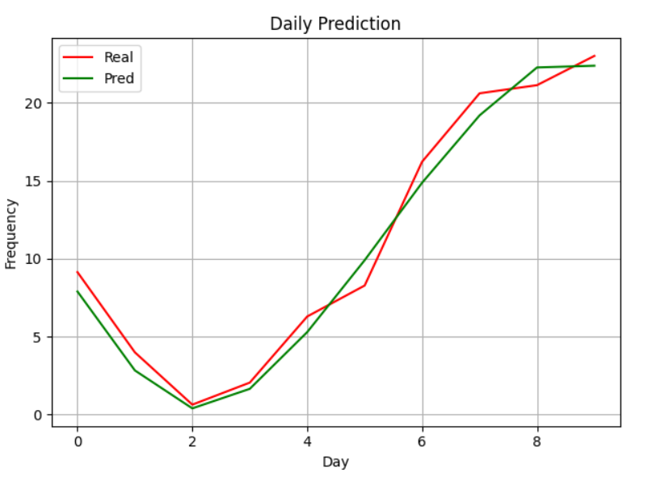

🌡 Climate Change: Turkiye Temperature Data

## 📦 Teknologies
- 🔍 Model: Seq2Seq LSTM (Encoder-Decoder)
- 📚 Dataset: Climate Change: Earth Surface Temperature Data [Dataset](https://www.kaggle.com/datasets/berkeleyearth/climate-change-earth-surface-temperature-data?select=GlobalLandTemperaturesByCountry.csv)
- 🧠 Training: PyTorch
- 📁 Weights: Stored in `.pth`, auto-loaded on inference

## 🚀 Train Summary
- Epochs: 50
- Loss Function: `nn.MSELoss()`
- Optimizer: `Adam`

## Results
- Epoch: 50/50 | Train Loss: 0.028
- MSE Score: 2.633
- MAE Score: 1.304

